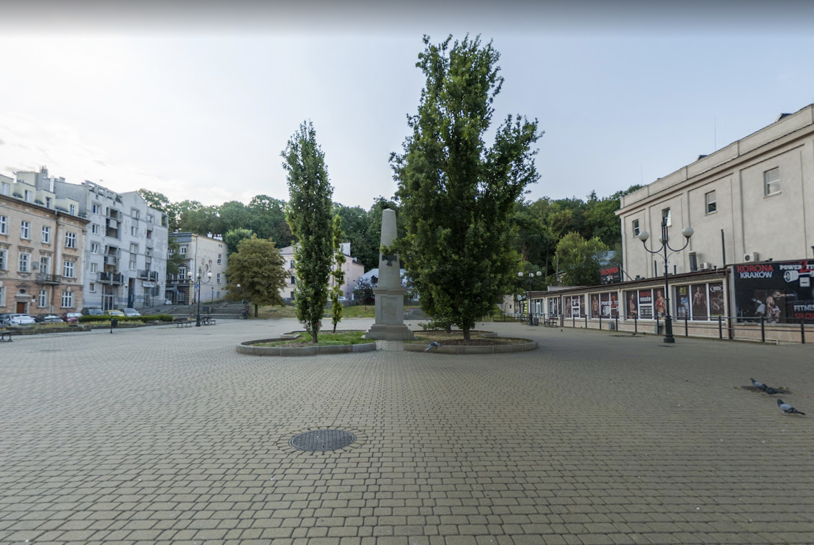

# Zwolnij na Placu

---

Plac Niepodległości w dzielnicy Podgórze to niezagospodarowany a tym samym smutny obraz zabetonowanego krajobrazu miejskiego.

Naszym celem jest aktywacja mieszkańców w tworzenie przestrzeni odpowiadającej ich potrzebom. Chcemy stworzyć miejsce zielone, przyjazne dla każdego. 

